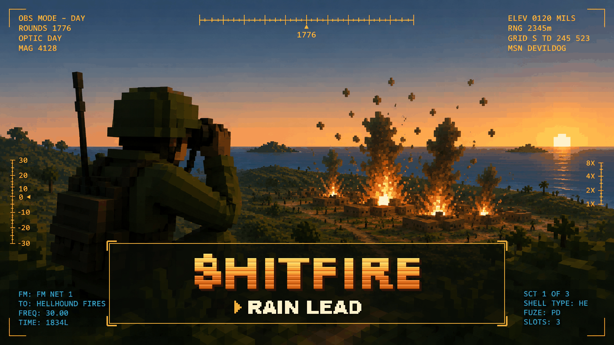
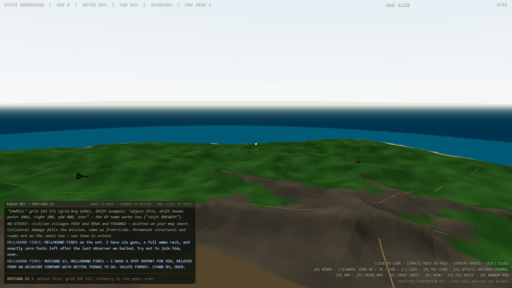
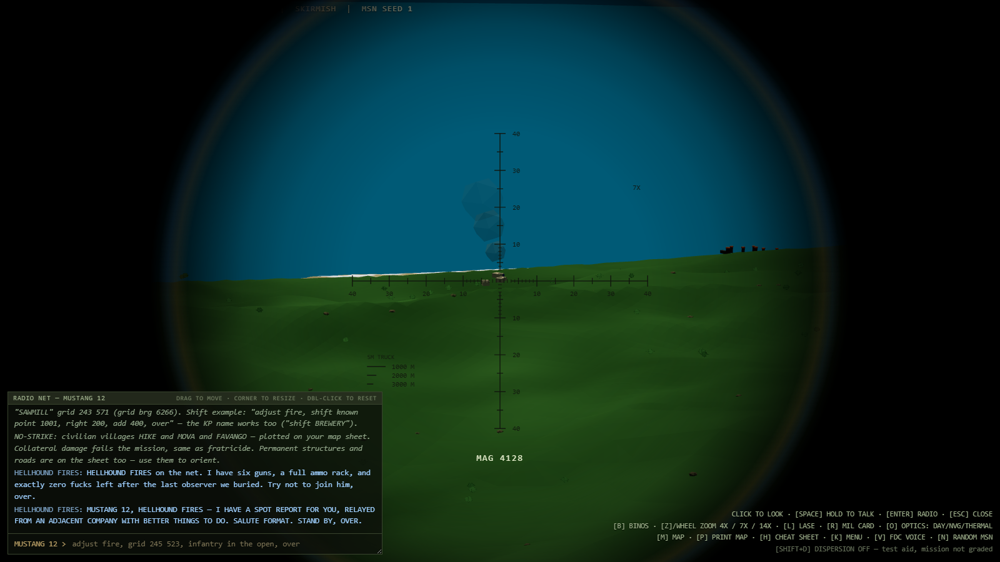
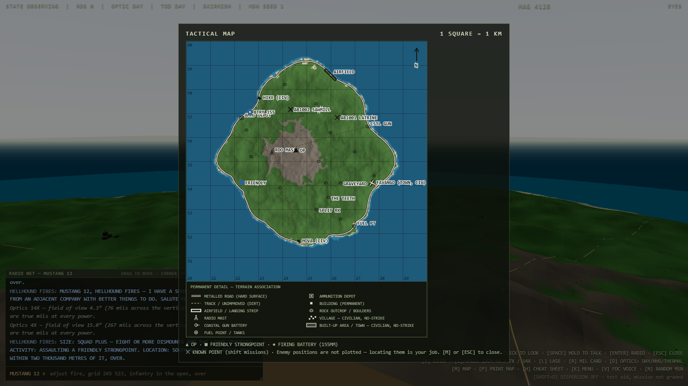

# SHITFIRE

  

**A single-file browser trainer for the FORWARD OBSERVER.** You sit on an OP over a low-poly WW2 Pacific island, locate a target with binos, laser, map, and compass, key the net, and talk a (rule-based, deeply unimpressed) fire direction center onto it: *observe → locate → transmit → observe impact → correct → fire for effect → assess*. The gun crew is a black box. You are the eyes.

- **Observer:** MUSTANG 12 (you) · **FDC:** HELLHOUND FIRES (sardonic, doctrinally flawless)
- One `SHITFIRE.html`. No server, no API keys, and **no network at runtime** — Three.js r160 and its addons are vendored in `vendor/` and inlined into the artifact as `data:` URLs, so the shipped file opens and runs fully offline. Players need nothing installed. (Contributors edit source in `src/` and run a small deterministic build script — see [CLAUDE.md](CLAUDE.md); that build step is dev-only and never touches how the shipped file runs.)
- Voice via the browser Web Speech API (push-to-talk + spoken FDC); **typed input always works without it**.
- Printable 1:50,000 topo sheets generated from the same heightfield as the 3D world — print one and do real mapwork alongside the sim.
- OP watchtower (+50 ft) raises the observer's eye height, feeding every line-of-sight check. Every mission logs to a **TLOG** transcript (comms, parse classification, impacts, AAR outcome), exportable as text/JSON from the mission menu, for reviewing or correcting FDC dialogue.

  
  
  

## Run it

Open `SHITFIRE.html` in **Chrome or Edge (desktop)**. That's it. Voice needs mic permission; print/save uses the browser print dialog. Gamepad and touch are supported.

## Controls

| Key | Action |
|---|---|
| Mouse / right stick | Look (magnetic heading readout in mils; net and map are grid, G-M angle 7°E) |
| `Space` (hold) / RB | Push-to-talk transmit |
| `B` | Binoculars (mil reticle) |
| `Z` / mouse wheel | Cycle binocular power 4X/7X/14X (`Shift+Z` steps back) |
| `L` | Laser rangefinder (in binos) |
| `O` | Cycle optics: DAY / NVG / THERMAL |
| `R` | Mil-relation reference card |
| `Shift+D` | Toggle round dispersion off (test aid — mission not graded when off) |
| `M` | Map · `P` map library / print |
| `K` | Mission menu · `N` random mission |
| Typed input box | Full fallback for every call |

## Current state

**The campaign is complete, Foreword through Epilogue, built end to end.** Typed and voice input, all three target-location methods (grid / polar / shift-from-known-point), an FDC with a real personality and radio audio, five scenario templates with difficulty tiers and danger-close rules, a printable map library, real-terrain (DEM) ingestion with gamepad/mobile support, a populated world (permanent structures, roads, villages, convoy pit stops), the full campaign structure (volumes, chapters, star grading, a bookshelf-style mission menu), a narrative layer (tutorial, chapter briefings, per-volume islands, strict-net mortars in the final volume), deeper forward-observer mechanics (adjustment coaching, the mil-relation/OT-factor workflow, doctrinal grading, wind, degraded optics, smoke/illumination missions), a full visual pass (dynamic sky and lighting, terrain detail, vegetation, water, persistent craters), and the SUNBURN epilogue with its SUNLAMP directed-energy finale. Two extras beyond the original spec: an OP watchtower and the TLOG session-transcript export (see above).

**[ROADMAP.md](ROADMAP.md)** carries the full build history (every stage, in order) and the live board of what's open now, organized by domain — frame rate, world, enemy behavior, radio net, time-of-day/tempo, rendering, the build artifact itself, and a future engine port.

## Scope: surface-to-surface only (for now)

The trainer covers **surface-to-surface fires** — 155mm artillery (6-digit / 100 m grids) and, in later campaign chapters, 60mm mortars (8-digit / 10 m grids). **Close air support (CAS / 9-line) is planned for a future volume** and is deliberately out of scope until the surface-to-surface campaign is finished. It appears in the mission menu only as a locked tease.

Islands are seeded with permanent structures, roads, and villages (see the World detail item below) so terrain association is a real, teachable skill — the FO can resect and orient off known landmarks like the airfield or the radio mast, plotted on the printed map and the `[M]` map with symbols and a legend. Enemy positions are never plotted. Civilian villages are populated and rendered distinctly from military elements; hitting civilians (**collateral damage**) is an automatic mission fail, exactly like fratricide.

## The Campaign — Volumes, Chapters, Stars

The scenario list is a **story-driven campaign** structured like a book series — see [NARRATIVE.md](NARRATIVE.md) for the full storyline. In brief:

- **Foreword — THE SCHOOLHOUSE**: the tutorial. Guided chapters that teach mils, the map, and your first complete call for fire.
- **Volume I — GREEN AS GRASS**: grid-mission fundamentals on your first island.
- **Volume II — THE RIDGE LINE**: polar and shift-from-known-point, terrain masking.
- **Volume III — THUNDER RUN**: moving targets, danger close, friendlies on the field.
- **Volume IV — BLACK SAND**: mastery — strict doctrine, 60mm precision missions, the final exam.
- **Epilogue — SUNBURN**: the goofy stuff, capped by a call for fire to an intergalactic directed-energy space cannon of mass destruction.
- **Volume V — ON WINGS** *(future)*: CAS. Locked. Coming eventually.

Each chapter is graded **0–5 stars, original-MW2 style**, displayed right on the mission-select menu. Stars come from competency (rounds-to-effect, first-round accuracy, format correctness, time) and are capped by difficulty — Easy caps at 3★, Normal at 4★, only Hard can earn 5★. Cumulative stars unlock the next volume. Fratricide is zero stars and an automatic fail, forever and always.

## Roadmap

**[ROADMAP.md](ROADMAP.md) is the single authority on what ships next and what is done.** This README describes what the trainer *is*; the board tracks the work. (A numbered backlog used to live here, drifted out of sync, and grew two different item #27s — it now lives in exactly one place, with stable IDs, and this file carries none.)

Every stage-numbered track (1–14, lettered tracks A–G) is **done** and lives in ROADMAP.md §4 as the historical record — the campaign runs Foreword through the Epilogue end to end. The board was reorganized by domain on 2026-07-30; open work is grouped as `PERF` (frame rate) · `WORLD` · `ENEMY` · `NET` · `TEMPO` (time of day / immediacy) · `GFX` (rendering beyond the shipped graphics plan) · `BUILD` · `PORT` (engine port), with exactly one row marked `NEXT` at a time. A few items — `G20`, `F4`, `14c`, and Volume V (CAS) — are explicitly parked at the user's direction and not scheduled.

Governing rule that outlives any one stage, worth stating in public: **this is a training instrument, not a demo.** Any change that makes a target harder to resolve at 1500–3200 m, blurs civilian/military discrimination, or obscures where a round landed is a regression *even if it looks better*.

## Files

| File | Purpose |
|---|---|
| [SHITFIRE.html](SHITFIRE.html) | The entire trainer |
| [ROADMAP.md](ROADMAP.md) | **The board** — what ships next, what's done, and which file answers which question |
| [SPEC.md](SPEC.md) | Full build spec + BUILD ORDER — the authority on *scope per stage* (ROADMAP owns order) |
| [NARRATIVE.md](NARRATIVE.md) | Campaign storyline: volumes, chapters, characters, humor rules |
| [DOCTRINE.md](DOCTRINE.md) | CFF formats, prowords, protocols — distilled from JFIRE 2019 + the JFO Student Handout |
| [GRAPHICS.md](GRAPHICS.md) | Visual-overhaul detail spec (stage 13) + the graphics ceiling analysis |
| [DIALOGUE_REVISIONS.md](DIALOGUE_REVISIONS.md) | Rewritten FDC quip pools and chapter beats (stage 14) |
| [CHEATSHEET.md](CHEATSHEET.md) | Condensed FO pull-up reference card — shipped in-sim as the `[H]` overlay (ROADMAP fix F3, done) |
| [TLO.md](TLO.md) | Terminal/Enabling Learning Objectives and star-grading crosswalk for the campaign |
| [ENGINE_PORT/](ENGINE_PORT/) | Plan and strategy for porting the sim to a game engine (Godot 4 recommended) — engine choice, architecture, parity testing, staged plan |
| [CLAUDE.md](CLAUDE.md) | Project rules for the coding agent |
| [QUICKSTART.md](QUICKSTART.md) | Stage-by-stage build workflow |
